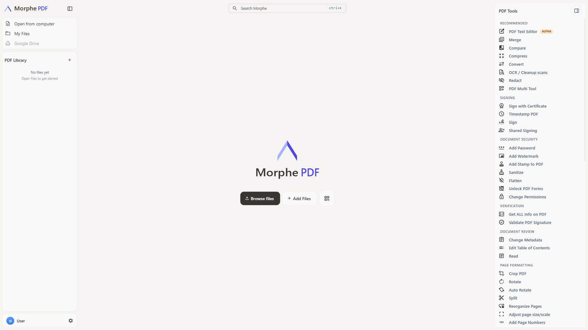

<p align="center">
  
</p>

<h1 align="center">Morphe PDF</h1>

<p align="center">
  A self-hosted PDF platform - edit, sign, redact, convert and automate PDFs without sending documents to anyone else's servers.
</p>

<p align="center">
  <em>Built on <a href="https://github.com/Stirling-Tools/Stirling-PDF">Morphe PDF</a>, with thanks.</em>
</p>



## Credits

Morphe PDF is a fork of **[Morphe PDF](https://github.com/Stirling-Tools/Stirling-PDF)** by Stirling PDF Inc.,
used under the MIT Licence. Essentially all of the PDF tooling, the editor, and the
50+ tools are their work; this fork adds security hardening and a different name and
mark on top of it. The original copyright notice is retained in [LICENSE](LICENSE), and
their documentation at <https://docs.stirlingpdf.com> remains the best reference for
what the tools do.

If Morphe PDF is useful to you, the upstream project is the place to send stars,
[contributions](https://github.com/Stirling-Tools/Stirling-PDF), and support.

## Key Capabilities

- **Everywhere you work** - Desktop client, browser UI, and self-hosted server with a private API.
- **50+ PDF tools** - Edit, merge, split, sign, redact, convert, OCR, compress, and more.
- **Automation & workflows** - No-code pipelines direct in UI with APIs to process millions of PDFs.
- **Enterprise‑grade** - SSO, auditing, and flexible on‑prem deployments.
- **Developer platform** - REST APIs available for nearly all tools to integrate into your existing systems.
- **Global UI** - Interface available in 40+ languages.

For a full feature list, see the docs: **https://docs.stirlingpdf.com**

## Quick Start

Morphe PDF does not publish its own container image yet, so the command below pulls
**upstream Stirling PDF** - useful for trying the tooling, but it does not include this
fork's changes. To run Morphe PDF, build from source (see the [Developer Guide](DeveloperGuide.md)).

```bash
docker run -p 8080:8080 docker.stirlingpdf.com/stirlingtools/stirling-pdf
```

Then open: http://localhost:8080

For full installation options (including desktop and Kubernetes), see upstream's [Documentation Guide](https://docs.stirlingpdf.com/#documentation-guide).

## Resources

These belong to upstream Stirling PDF and describe the tooling Morphe PDF inherits:

- [**Documentation**](https://docs.stirlingpdf.com)
- [**Homepage**](https://stirling.com)
- [**API Docs**](https://registry.scalar.com/@stirlingpdf/apis/stirling-pdf-processing-api/)
- [**Server Plan & Enterprise**](https://docs.stirlingpdf.com/Paid-Offerings)

## Support

- **Issues with this fork**: [Morphe PDF issues](https://github.com/binesh-balan/Morphe/issues)
- **Issues with the underlying tools**: [upstream issues](https://github.com/Stirling-Tools/Stirling-PDF/issues) - please confirm the problem reproduces on upstream Stirling PDF before reporting it there.
- **Community**: upstream's [Discord](https://discord.gg/HYmhKj45pU) (a Morphe PDF community, not a Morphe PDF one)

## Contributing

We welcome contributions! Please see [CONTRIBUTING.md](CONTRIBUTING.md) for guidelines.

This project uses [Task](https://taskfile.dev/) as a unified command runner for all build, dev, and test commands. Run `task dev` to get started running the editor, run `task` to see the most common commands, or see the [Developer Guide](DeveloperGuide.md) for full details.

For adding translations, see the [Translation Guide](devGuide/HowToAddNewLanguage.md).

## License

MIT, inherited from Morphe PDF - copyright (c) 2025 Stirling PDF Inc. See [LICENSE](LICENSE).
Upstream is open-core: some enterprise features live under a separate proprietary licence,
and that split carries over to this fork unchanged.
